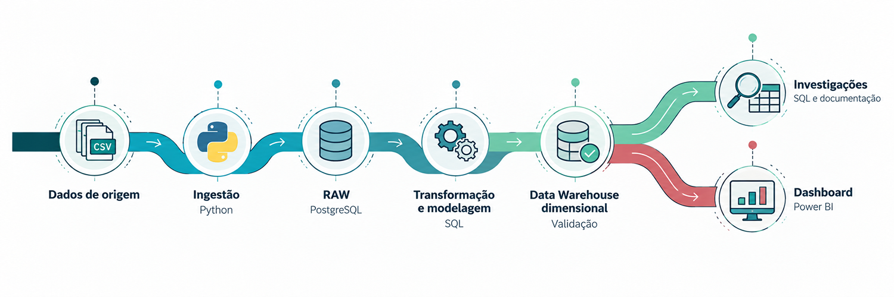
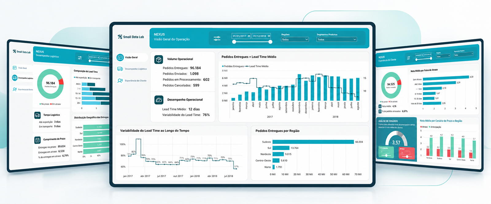

# Data Explorer

### *Da estruturação dos dados à descoberta de fenômenos de negócio.*


O **Data Explorer** é um projeto de Analytics que percorre o ciclo analítico, da estruturação dos dados à investigação de fenômenos de negócio.

O projeto combina engenharia de dados, SQL, Python e Power BI para construir uma base analítica reproduzível, investigar padrões operacionais e logísticos e explorar associações entre o desempenho das entregas e a experiência dos clientes.

Como solução independente, reúne a infraestrutura, as investigações documentadas e um dashboard interativo, permitindo compreender tanto a construção da camada analítica quanto os resultados obtidos a partir dela.

---

## 1. O que foi construído

O Data Explorer reúne quatro entregas principais:

* **Fundação de dados:** ingestão, preservação dos dados de origem e modelagem dimensional.
* **Confiabilidade:** validações automatizadas e ambiente reproduzível.
* **Investigação analítica:** quatro estudos documentados, com consultas SQL e análises dos resultados.
* **Visualização:** dashboard interativo desenvolvido no Power BI.

A arquitetura prioriza clareza, rastreabilidade e reprodutibilidade, mantendo a complexidade técnica proporcional aos objetivos do projeto.

---

## 2. Arquitetura

O fluxo analítico parte dos dados de origem e percorre as etapas de ingestão, transformação, modelagem e validação, até disponibilizar os dados para investigação e visualização.



O PostgreSQL concentra as camadas de dados, com a separação entre a estrutura RAW e o Data Warehouse dimensional. A base resultante alimenta as investigações analíticas e o dashboard no Power BI.

---

## 3. Pipeline

### Ingestão

A ingestão é realizada em Python, utilizando `psycopg` e o comando `COPY` do PostgreSQL. Os dados são carregados inicialmente na camada `RAW`, preservando sua estrutura de origem antes das transformações.

### Modelagem

Scripts SQL versionados realizam as transformações e constroem o Data Warehouse dimensional, organizado em dimensões e fatos para o consumo analítico.

### Validação

Após a construção do Data Warehouse, são executadas validações automatizadas para verificar a consistência das estruturas e dos dados processados.

---

## 4. Investigações e insights

As investigações exploram diferentes dimensões do comportamento operacional, logístico e da experiência do cliente. Cada estudo combina consultas SQL e análise descritiva para identificar padrões, comparar comportamentos e interpretar resultados relevantes para a operação.

### Volume e estabilidade operacional

Investigação da relação entre o volume de pedidos, o comportamento dos prazos e sua variabilidade ao longo do tempo.

* A correlação global entre o volume mensal de pedidos e o prazo médio foi praticamente nula (`r ≈ 0,003`), mas apresentou diferenças entre os períodos: associação positiva fraca em 2017 (`r ≈ 0,225`) e moderada em 2018 (`r ≈ 0,685`).
* A comparação anual deve considerar que 2018 contempla apenas oito meses, de janeiro a agosto, e que as diferenças entre correlações não demonstram, por si só, uma mudança estrutural.
* O coeficiente de variação dos prazos oscilou entre aproximadamente 0,57 e 1,10, apresentando variações que não acompanharam proporcionalmente o crescimento do volume.

**Explorar:** [Relatório analítico](investigations/volume_estabilidade_operacional.md) · [Consulta SQL](investigations/volume_estabilidade_operacional.sql)

### Comportamento do ciclo operacional

Análise da distribuição do ciclo operacional e do comportamento dos componentes de expedição e transporte.

* Aproximadamente 71,3% dos pedidos apresentaram ciclos de até 14 dias, enquanto os ciclos superiores a 20 dias representaram aproximadamente 15,4% da população analisada.
* Entre as faixas de 0 a 6 dias e acima de 20 dias, o tempo médio entre envio e entrega aumentou de 2,67 para 23,22 dias. No mesmo intervalo, o tempo médio até o envio passou de 1,63 para 5,79 dias.
* A diferença entre os componentes evidencia uma variação mais expressiva do tempo de transporte nas faixas de ciclos mais longos.

**Explorar:** [Relatório analítico](investigations/comportamento_ciclo_operacional.md) · [Consulta SQL](investigations/comportamento_ciclo_operacional.sql)

### Contexto do comportamento logístico

Investigação das diferenças no comportamento das entregas entre regiões, estados e rotas de origem e destino, explorando possíveis variações nos padrões logísticos.

* O Sudeste concentrou 66.004 pedidos e apresentou o menor tempo médio de transporte entre as regiões, de 7,50 dias. O Norte registrou a maior média, de 19,23 dias, enquanto o Nordeste apresentou a maior proporção de atrasos, de 12,76%.
* A análise por estado revelou diferenças internas às regiões. Entre os estados com volumes expressivos, Bahia e Rio de Janeiro apresentaram proporções de atraso de 12,17% e 12,14%, respectivamente.
* Nas análises por rota, Sudeste → Nordeste apresentou 12,95% de atrasos, enquanto Sudeste → Norte registrou tempo médio de transporte de 19,21 dias e 9,13% de atrasos. Os resultados mostram que tempos de transporte mais elevados não correspondem necessariamente às maiores proporções de atraso.

**Explorar:** [Relatório analítico](investigations/contexto_comportamento_logistico.md) · [Consulta SQL](investigations/contexto_comportamento_logistico.sql)

### Experiência do cliente

Análise da associação entre o comportamento das entregas, a intensidade dos atrasos e as avaliações registradas pelos clientes.

* A nota média geral foi de 4,16, considerando 94.525 pedidos avaliados, de um total de 96.184 pedidos entregues.
* As entregas antecipadas apresentaram nota média de 4,30, as realizadas na data prevista, 4,04, e as atrasadas, 2,27.
* A nota média diminuiu conforme aumentou a intensidade do atraso, chegando a 1,61 na faixa de 15–30 dias. Na faixa superior a 30 dias, houve recuperação parcial para 2,05, em um grupo de apenas 322 pedidos.
* A distribuição das avaliações reforça esse comportamento: as notas 1 representaram 6,51% dos pedidos sem atraso e aproximadamente 71% nas faixas de 8–14 e 15–30 dias.

As diferenças observadas representam associações descritivas. As avaliações também podem refletir aspectos relacionados ao produto e ao vendedor, não sendo possível atribuir exclusivamente à logística as variações nas notas.

**Explorar:** [Relatório analítico](investigations/experiencia_cliente.md) · [Consulta SQL](investigations/experiencia_cliente.sql)

---

## 5. Dashboard interativo

O Data Explorer conta com um dashboard interativo desenvolvido no Power BI, organizado em três páginas:

* **Visão Geral da Operação:** apresenta os principais indicadores de volume e comportamento operacional.

* **Desempenho Logístico:** explora a composição do ciclo operacional, o cumprimento dos prazos e a distribuição geográfica das entregas.

* **Experiência do Cliente:** apresenta as avaliações e sua associação com o cumprimento dos prazos de entrega.

[](https://app.powerbi.com/view?r=eyJrIjoiNzdlZTM1ZjktMDdkYS00OGZmLWJiMjYtNmZhYjk3NDllYmE3IiwidCI6ImU0MTA4ZjAxLTI2YzktNGRlMi05YWIyLTcwODgzZDA3ZTg0NCJ9)

*Explore o dashboard interativo clicando na imagem acima.*

O relatório publicado permite explorar os dados por meio de filtros e visualizações interativas. A disponibilidade das informações depende da versão publicada e da configuração de atualização do relatório.

---

## 6. Estrutura do projeto

```
data-explorer/
├── data/
│   └── olist.zip
│
├── scripts/
│   └── ingest_raw.py
│
├── sql/
│   ├── 00_criar_schemas.sql
│   ├── 01_criar_dim_cliente.sql
│   ├── 02_criar_dim_produto.sql
│   ├── 03_criar_dim_vendedor.sql
│   ├── 04_criar_fato_pedido.sql
│   ├── 05_criar_fato_review.sql
│   ├── 06_criar_fato_item_pedido.sql
│   ├── 07_segmentar_produtos.sql
│   ├── 08_enriquecer_fato_pedido.sql
│   └── 09_validar_dw.sql
│
├── investigations/
│   ├── volume_estabilidade_operacional.sql
│   ├── volume_estabilidade_operacional.md
│   ├── comportamento_ciclo_operacional.sql
│   ├── comportamento_ciclo_operacional.md
│   ├── contexto_comportamento_logistico.sql
│   ├── contexto_comportamento_logistico.md
│   ├── experiencia_cliente.sql
│   └── experiencia_cliente.md
│
├── dashboard/
│   ├── DataExplorer.pbip
│   ├── DataExplorer.Report/
│   ├── DataExplorer.SemanticModel/
│   └── assets/
│
├── docs/
│   └── images/
│       ├── data-explorer-architecture.png
│       └── data-explorer-dashboard.png
│
├── docker-compose.yml
├── pyproject.toml
├── uv.lock
├── setup.sh
├── setup.ps1
└── README.md
```

| Diretório ou arquivo         | Responsabilidade                                |
| ---------------------------- | ----------------------------------------------- |
| `data/`                      | Dados de origem utilizados no pipeline          |
| `scripts/`                   | Automação da ingestão                           |
| `sql/`                       | Construção, transformação e validação dos dados |
| `investigations/`            | Investigações analíticas em SQL e Markdown      |
| `dashboard/`                 | Projeto e recursos do Power BI                  |
| `docs/images/`               | Imagens de apoio à documentação                 |
| `docker-compose.yml`         | Configuração do PostgreSQL                      |
| `setup.sh` e `setup.ps1`     | Automação da configuração do ambiente           |
| `pyproject.toml` e `uv.lock` | Configuração e dependências Python              |

---

## 7. Reprodução

O projeto foi estruturado para permitir a reconstrução do ambiente analítico a partir do repositório.

### Pré-requisitos

* Git
* Docker
* Python 3.12+
* uv

### Variáveis de ambiente

Crie um arquivo `.env` na raiz do repositório com as credenciais utilizadas pelo PostgreSQL:

```
POSTGRES_DB=nexus
POSTGRES_USER=nexus
POSTGRES_PASSWORD=SUA_SENHA
```

Substitua `SUA_SENHA` pela senha desejada para o ambiente local.

### Execução

Clone o repositório e acesse o diretório do projeto:

```
git clone https://github.com/smalldatalabbr/data-explorer.git
cd data-explorer
```

Execute o script correspondente ao seu sistema operacional.

**Linux e macOS**

```
./setup.sh
```

**Windows (PowerShell)**

```
.\setup.ps1
```

Os scripts automatizam o processo de configuração do ambiente:

1. Iniciam o PostgreSQL via Docker Compose.
2. Criam os schemas.
3. Executam a ingestão dos dados.
4. Constroem o Data Warehouse.
5. Executam as validações finais.

Ao término, o ambiente estará disponível em:

```
Host:     localhost
Port:     5432
Database: nexus
User:     nexus
```
---

## 8. Limitações e considerações analíticas

As análises possuem caráter exploratório e descritivo, sendo baseadas em dados públicos de um contexto específico de marketplace.

As associações identificadas não estabelecem causalidade e devem ser interpretadas considerando as populações, os filtros e as limitações dos dados utilizados. Os resultados não constituem previsões de desempenho futuro.

---

## 9. Fontes e referências

Os dados utilizados neste projeto são provenientes do conjunto público de dados de e-commerce brasileiro disponibilizado pela Olist.

**Fonte:** [Olist Brazilian E-Commerce Public Dataset - Kaggle](https://www.kaggle.com/datasets/olistbr/brazilian-ecommerce)

A base contempla registros de pedidos, itens, produtos, clientes, vendedores e avaliações, permitindo explorar diferentes dimensões do contexto operacional e comercial.

---

## 10. Tecnologias

* **Python:** ingestão e automação.
* **PostgreSQL:** armazenamento e camada analítica.
* **SQL:** transformação, modelagem, validação e investigação.
* **Docker:** ambiente reproduzível.
* **uv:** gerenciamento do ambiente Python.
* **Power BI:** exploração e visualização analítica.

---

## Licença

Este repositório é licenciado sob a [MIT License](LICENSE).